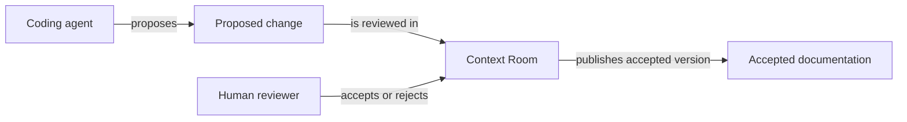

# Context Room Documentation

## Purpose

Create one body of durable project truth that is easy for a human to understand and precise enough for an agent to build from.

The documentation covers the whole project, not only its code:

- why the project exists and how it should be perceived;
- what it promises and delivers;
- how it works technically;
- how it is marketed, sold, delivered, and operated;
- how quality, safety, and compliance are proven; and
- how the project changes over time.

Use the simplest structure and format that make the truth clear. Do not create documentation bureaucracy.

## Non-negotiable rules

1. **One durable truth, one canonical owner.** Update the existing owner instead of creating a competing explanation.
2. **Current and target truth stay separate.** Normal project documents describe what is true now. Desired changes live under `docs/evolution/changes/active/` until completed.
3. **The path classifies the document.** Do not repeat type, domain, truth state, owner, or review status in metadata when the path or Context Room already determines them.
4. **Metadata stays minimal.** A document declares only its stable ID, direct maintenance dependencies, and meaningful project artifacts.
5. **References are not dependencies.** A normal link helps a reader navigate. `depends_on` means the current document may need review when the target changes.
6. **The body stays human-readable.** Structure documents for agents without turning them into machine forms.
7. **No empty templates.** Add a section or directory only when it carries useful information.
8. **Diagrams explain; they do not decorate.** Each diagram answers one explicit question.
9. **Use the simplest adequate format.** Markdown first, Mermaid for relationships and flow, HTML for richer spatial explanation, PNG only for static visual evidence or external material.
10. **Human review remains authoritative.** Never write `accepted`, `verified`, a review date, or an inverse dependency into document metadata.

## Workflow

Follow this sequence whenever creating, restructuring, or updating documentation.

### 1. Determine whether the information is durable

Document information that must still be discoverable and treated as true in future work.

Do not turn these into canonical project documents unless they produce a durable result:

- raw brainstorming;
- transient task notes;
- every meeting transcript;
- an issue backlog;
- temporary agent reasoning;
- generated reports already owned by another system; or
- implementation details that are obvious from the code and have no durable design meaning.

### 2. Find the canonical owner before writing

Search accepted documentation before creating a file. When Context Room is available, prefer its deterministic documentation commands:

```bash
context-room docs search "<subject>" --status current
context-room docs related <path>
context-room docs trace <path>
context-room docs read <path-or-section>
```

Update the existing owner when one exists. Create a new document only when the subject has an independent responsibility, evolves independently, is referenced from several places, or no existing document can own it clearly.

If a durable fact is genuinely unresolved and blocks correctness, keep it explicit as an open question rather than silently inventing an answer.

### 3. Choose the location

Place the document in the universal project structure below. The path should make its role evident without reading metadata.

### 4. Choose the simplest format

Use the format decision rules in this skill. A diagram or HTML document is justified only when it removes real cognitive work.

### 5. Add the minimal document contract

Give the document:

- a stable `context_room.id`;
- only direct `depends_on` relationships;
- only meaningful `artifacts`;
- a literal title;
- a one-sentence summary;
- what it defines; and
- what it does not define.

Then structure the rest naturally for the subject.

### 6. Connect without duplicating

Use body links for related explanations and navigation. Use `depends_on` only for strong maintenance dependencies. Link to machine contracts and implementation artifacts rather than copying them into prose.

### 7. Check current versus target truth

When changing the project, describe the proposed delta in `docs/evolution/changes/active/`. Update current documents only as part of the implementation and review. Once completed, archive the change and ensure no current truth remains only in the archived change.

### 8. Validate and route the change

Check IDs, links, dependencies, artifacts, diagrams, and current/target separation. Run the narrowest relevant project checks and `context-room doctor --root .` when available.

For local documentation, leave the exact changed version for human review. For accepted shared documentation, use the shared proposal workflow. Never accept, reject, or verify a document on the user's behalf.

## Universal documentation architecture

Use these six stable zones for every project:

```text
README.md
AGENTS.md

docs/
├── INDEX.md
├── PROJECT-MAP.diagram.md
│
├── strategy/
│   ├── project.md
│   ├── market/
│   ├── audiences/
│   ├── positioning.md
│   ├── brand.md
│   ├── messaging.md
│   ├── business-model.md
│   ├── goals.md
│   └── principles.md
│
├── product/
│   ├── offer.md
│   ├── capabilities/
│   ├── journeys/
│   ├── experience/
│   ├── policies/
│   ├── pricing.md
│   └── content/
│
├── system/
│   ├── architecture.md
│   ├── components/
│   ├── contracts/
│   ├── data/
│   ├── flows/
│   ├── infrastructure/
│   └── integrations/
│
├── operations/
│   ├── marketing/
│   ├── communications/
│   ├── sales/
│   ├── launch/
│   ├── delivery/
│   ├── support/
│   ├── deployment/
│   ├── runbooks/
│   ├── team/
│   ├── finance/
│   └── legal/
│
├── quality/
│   ├── requirements.md
│   ├── verification/
│   ├── metrics/
│   ├── security/
│   ├── privacy/
│   ├── compliance/
│   └── risks/
│
└── evolution/
    ├── changes/
    │   ├── active/
    │   └── archive/
    ├── decisions/
    └── records/
        ├── incidents/
        ├── experiments/
        └── releases/
```

This tree is a vocabulary, not a checklist. Do not create empty folders or placeholder files.

### What each zone answers

| Zone | Question |
| --- | --- |
| `strategy/` | Why does the project exist, for whom, and what position or perception should it create? |
| `product/` | What does the project promise and deliver to users? |
| `system/` | How is the product technically realized? |
| `operations/` | How is it marketed, communicated, sold, launched, delivered, supported, and run? |
| `quality/` | How do we know it is good, safe, reliable, measurable, and compliant? |
| `evolution/` | What is changing, why was a choice made, and what happened historically? |

### Scaling rules

- A small project may have one or two files in each relevant zone.
- Add subdirectories only when the project needs them.
- In large projects, keep the category before the domain, for example:

```text
docs/product/capabilities/billing/invoices.md
docs/system/components/billing/invoice-service.md
docs/quality/verification/billing/invoice-integrity.md
```

- A small subject is one file.
- A large subject becomes a directory with `index.md` as its entry point and focused child documents or assets.
- `docs/INDEX.md` is a short navigation map. It must not become another owner of project truth.
- `docs/PROJECT-MAP.diagram.md` is recommended once the project has several domains or enough documents that the hierarchy is no longer obvious.

## Document kinds

Do not impose a rigid template for every kind. Use the location and the subject to decide the natural body.

Typical durable documents include:

- strategy foundations, market research, audiences, positioning, brand, messaging, goals, and business model;
- product offers, capabilities, journeys, experience rules, policies, pricing, and product content;
- system architecture, components, contracts, data models, flows, infrastructure, and integrations;
- operational plans and procedures for marketing, communication, sales, launch, delivery, support, deployment, team, finance, and legal work;
- quality requirements, evaluations, metrics, security, privacy, compliance, and risks;
- active changes, decisions, incidents, experiments, and releases; and
- visual maps, flows, states, and sequences that make the project easier to understand.

The common document contract is fixed. The body is not.

## Common Markdown document contract

Use this structure literally for normal Markdown documents:

```markdown
---
context_room:
  id: product.review.human-approval

  depends_on:
    - strategy.trust.human-control

  artifacts:
    code:
      - src/review/**
    tests:
      - test/review/**
---

# Human document approval

> **Summary:** A document version becomes trusted only after a human accepts its exact content.
>
> **Defines:** The observable approval, rejection, and invalidation rules for document review.
>
> **Does not define:** Git transport, proposal branch mechanics, or the internal storage format.

## How approval works

Start directly with the durable information the reader needs.

## Evidence

Include only when tests, metrics, research, schemas, or observations are necessary.

## Open questions

Include only when real unresolved questions exist.
```

Only these body elements are required:

1. a literal title;
2. `Summary`;
3. `Defines`;
4. `Does not define`; and
5. the useful body.

`Evidence` and `Open questions` are optional. Delete them when empty.

## Writing the clearest possible document

### State the answer first

The summary must express the main durable truth, not announce that the document exists.

Bad:

```text
This document explains the review system.
```

Better:

```text
A document version becomes trusted only after a human accepts its exact content.
```

### Make ownership explicit

`Defines` states what this file is the primary reference for.

`Does not define` names nearby subjects that belong elsewhere. Link to their owners when that helps the reader.

### Keep one primary subject per document

The sentence “This document is the primary reference for…” should have a simple answer. Split the document when independent subjects have different reasons to change or different natural readers.

### Start with current truth, not the history of thought

Put the current rule, conclusion, or behavior first. Put historical reasoning in `docs/evolution/decisions/` when it is important enough to preserve.

### Separate rules from rationale

A rule must be distinguishable from the reason behind it. Use normative language such as `MUST`, `MUST NOT`, `SHOULD`, and `MAY` only when the distinction matters.

### Use informative headings

Prefer headings such as:

```text
How a document becomes accepted
What invalidates an approval
Behavior when the shared repository is offline
```

Avoid vague headings such as `Overview`, `Details`, `Other`, or `Notes` unless they are genuinely the clearest label.

### Do not duplicate truth

State durable information in one owner and link to it elsewhere. Other documents may explain the consequence for their own scope, but must not maintain a competing copy of the same rule.

### Keep exact machine contracts machine-readable

OpenAPI, JSON Schema, Protobuf, database definitions, and similar artifacts own mechanical detail. The human document explains purpose, semantics, compatibility, examples, and tradeoffs, then links to the exact contract.

### Make uncertainty visible

Record a blocking unknown as an explicit open question. Do not write an assumption as current truth. Remove resolved questions and integrate the answer into the owning section.

### Prefer concise completeness

Remove prose that does not change understanding, a decision, or an action. Do not remove edge cases, constraints, failure behavior, or evidence merely to shorten the file.

## Metadata contract

The target Context Room document metadata contains only:

```yaml
context_room:
  id: zone.domain.subject
  depends_on:
    - another.document.id
  artifacts:
    code:
      - path/**
```

`depends_on` and `artifacts` are optional. `id` is required for every first-class document.

### `id`

The ID is the stable identity of the document.

Rules:

- use lowercase dot-separated words;
- make it descriptive and unique inside the documentation corpus;
- derive it from the initial logical location when useful;
- do not change it merely because the file moves or is renamed; and
- use document IDs, not file paths, in `depends_on` and Context Room diagram links.

Examples:

```yaml
id: strategy.positioning
id: product.review.human-approval
id: system.review.review-engine
id: evolution.change.folder-review
```

### `depends_on`

`depends_on` is the only explicit semantic relationship required by this model.

Its precise meaning is:

> If the target document changes significantly, this document may need to be reviewed again.

Rules:

- declare only direct dependencies;
- do not list transitive dependencies;
- do not use it merely because another document is interesting or related;
- target stable document IDs;
- never maintain the inverse manually; Context Room derives “depended on by” automatically; and
- when a dependency also helps the reader, keep a normal body link as well.

Example:

```yaml
context_room:
  id: system.review.review-engine
  depends_on:
    - product.review.human-approval
    - product.review.human-owned-policy
```

### Body links and backlinks

A Markdown link or HTML `href` is a reference, not automatically a dependency.

```markdown
See [Human approval](../../product/review/human-approval.md).
```

Context Room should index it as:

```text
references
referenced by
```

Use a normal link when the purpose is navigation, context, attribution, or further reading.

If the current document would become potentially stale when the target changes, also declare the target in `depends_on`. Context Room may merge the YAML declaration and body link into one relationship with two recorded origins.

Do not add a generic `related_to` field. Ordinary references already cover that need.

### `artifacts`

Artifacts connect documentation to the real project without turning every source file into a document node.

Supported categories may include:

```yaml
artifacts:
  code:
    - src/review/**
  tests:
    - test/review/**
  schemas:
    - schemas/review-state.schema.json
  config:
    - .context-room/config.json
  telemetry:
    - observability/review-dashboard.json
  assets:
    - review-flow.png
  examples:
    - examples/review-state.json
```

Rules:

- use project-relative paths or deliberate globs;
- include only artifacts that materially implement, verify, configure, measure, or illustrate the document;
- do not turn `artifacts` into an exhaustive source map; and
- use `schemas` for machine schemas, not for visual diagrams.

### Do not store these fields manually

Do not add these merely to repeat information Context Room can infer or owns itself:

```text
type
domain
authority
truth
owner
status
stage
accepted
last_verified
verified_hash
reverse dependencies
```

The path classifies the document. Context Room and Git own review state, exact hashes, revisions, and history.

### Legacy metadata

When editing a project that already uses another metadata contract, preserve it unless the task explicitly includes a migration. Apply the architecture, ownership, writing, linking, and format rules immediately, but do not silently rewrite every frontmatter block.

## Format selection

Use this order:

```text
Clear in prose or a small table?
  → Markdown

Primarily relationships, order, states, boundaries, or handoffs?
  → Mermaid in Markdown

Needs precise spatial composition, multiple views, rich comparison, or native interaction?
  → HTML

Static screenshot, external visual, or visual evidence?
  → PNG or SVG attached to a text document
```

## Markdown

Markdown is the default for durable truth, rules, explanations, decisions, changes, procedures, and references.

Use YAML frontmatter at the beginning of the file:

```markdown
---
context_room:
  id: product.billing.invoice-export
  depends_on:
    - strategy.offer.billing
  artifacts:
    code:
      - src/billing/export/**
---

# Invoice export

> **Summary:** ...
>
> **Defines:** ...
>
> **Does not define:** ...
```

Use tables only for aligned comparison. Use lists only for genuinely discrete items. Prefer prose when the relationship between ideas matters.

## Mermaid diagram documents

Use Mermaid as the default diagram format because it remains text, diffable, searchable, and easy for humans and agents to edit.

### File convention

Use a separate diagram document when the visual is a reusable map, a cross-document explanation, or a navigation point:

```text
PROJECT-MAP.diagram.md
review-map.diagram.md
review-flow.diagram.md
proposal-states.diagram.md
```

Use an embedded Mermaid block inside a normal Markdown document when the diagram explains only one local section.

A standalone diagram document uses the same YAML and body contract as Markdown:

````markdown
---
context_room:
  id: system.review.review-flow
  depends_on:
    - product.review.human-approval
    - system.review.review-engine
---

# Review flow

> **Summary:** This diagram shows how an agent proposal becomes accepted documentation through a human decision.
>
> **Defines:** The actors, handoffs, and outcomes in the document review flow.
>
> **Does not define:** Git transport details or the internal review-state schema.


````

### Diagram families

Use three broad families rather than a large taxonomy:

- **Map** — parts, actors, ownership, boundaries, and main connections;
- **Flow** — order, actions, handoffs, branches, errors, and sequences; and
- **State** — lifecycle states and the events that cause transitions.

A sequence diagram is a focused form of flow. An explicit decision tree is also a flow.

### Diagram rules

- State the one question the diagram answers.
- Prefer 5 to 15 meaningful nodes in one view.
- Keep one main reading direction.
- Label non-obvious arrows with natural language.
- Keep node labels short and put detail in the surrounding text.
- Split a diagram when crossings or scale make it harder to read.
- Use color only as a secondary signal.
- Do not make a diagram for an idea that is clearer in a few sentences.
- Arrow labels are explanatory and free-form; they are not YAML dependency types.

### Hierarchy for large projects

Scale visual understanding through levels:

1. `docs/PROJECT-MAP.diagram.md` — six zones and major domains;
2. domain maps — main actors, parts, boundaries, and entry points; and
3. focused flows or state diagrams — one behavior or lifecycle.

The project map links to domain maps. Domain maps link to focused diagrams and detailed documents. Never create one diagram containing the entire project.

### Context Room links in Mermaid

Use the Context Room URI convention for nodes that represent first-class documents:

```mermaid
click review "cr://product.review.human-approval"
click states "cr://system.review.proposal-states#rejected"
```

Context Room resolves the stable ID to the document's current path and optional section. Do not use JavaScript callbacks. Nodes that are merely concepts do not need links.

A visual arrow does not create `depends_on`. Declare a YAML dependency only when the diagram itself may become stale after the target document changes.

## Visual HTML documents

Use HTML only when Mermaid or Markdown cannot express the subject clearly enough, for example:

- several coordinated views on one page;
- a rich architecture or market map;
- a positioning matrix;
- a dashboard or scorecard;
- a complex comparison;
- expandable secondary detail;
- a reasoning map; or
- a layout where spatial grouping is essential to understanding.

Do not use HTML merely to make simple prose look more decorative.

### HTML metadata

Keep the file valid HTML and place the same YAML contract in a comment immediately after the doctype:

```html
<!doctype html>

<!--
context_room:
  id: strategy.positioning.market-map
  depends_on:
    - strategy.positioning
  artifacts:
    assets:
      - market-research.csv
-->

<html lang="en">
```

### HTML body contract

The rendered page must visibly contain the same information as a Markdown document:

- a literal title;
- summary;
- what it defines;
- what it does not define; and
- the useful visual content.

Use semantic HTML, native controls, accessible reading order, keyboard-visible focus, and Context Room theme classes or variables. Do not embed scripts, external runtime dependencies, or a second theme system. The primary conclusion must remain visible without interaction.

### Context Room links in HTML

Use a real anchor for browser behavior and a stable document ID for Context Room resolution:

```html
<a
  class="cr-diagram-node"
  href="../../product/review/human-approval.md"
  data-cr-document="product.review.human-approval">
  <strong>Human approval</strong>
  <span>Only a human can accept the exact document version.</span>
</a>
```

`href` is the portable fallback. `data-cr-document` is the stable identity. Context Room may correct or warn about an outdated fallback path.

## PNG, SVG, and other image files

Do not embed Context Room YAML in a binary PNG, EXIF metadata, or an image-only side channel.

Images are normally artifacts attached to a Markdown or HTML owner. Use them for:

- screenshots;
- evidence of an external state;
- externally supplied visuals;
- photographs;
- design mockups; or
- static renders whose editable source is also preserved.

Reference the image from the owner's metadata:

```yaml
context_room:
  id: evolution.record.incident-42
  artifacts:
    assets:
      - error-screen.png
      - incident-timeline.svg
```

If an image must be discoverable as a standalone visual document, create a text wrapper with the same document contract:

```text
error-screen.png
error-screen.image.md
```

The wrapper owns:

- the stable ID and dependencies;
- title, summary, scope, and exclusions;
- accessible alt text and caption;
- provenance, capture date, and source when relevant; and
- the link to the image under `artifacts.assets`.

Do not make an image the only place where an essential rule or explanation exists. A PNG cannot provide navigable Context Room nodes; use Mermaid or HTML when redirection is part of the purpose.

## Raw Mermaid and machine schemas

A raw `.mmd` file is normally an asset of a Markdown or HTML document. Prefer `.diagram.md` when the diagram is itself a first-class document.

OpenAPI, JSON Schema, Protobuf, SQL definitions, and similar machine contracts normally remain artifacts. Do not inject Context Room metadata into their native top-level structure. Pair them with a Markdown owner that explains their meaning and references them under `artifacts.schemas`.

## Dependencies, references, and visual links

Keep these concepts separate:

| Connection | Source | Meaning |
| --- | --- | --- |
| Maintenance dependency | YAML `depends_on` | The current document may need review when the target changes. |
| Reference | Markdown link or HTML `href` | The target helps the reader understand or navigate. |
| Visual connection | Mermaid arrow or HTML diagram edge | Explains how concepts, actors, states, or parts relate in this visual. |
| Artifact connection | YAML `artifacts` | Connects the document to code, tests, schemas, config, telemetry, examples, or assets. |

Context Room should derive:

```text
depends on / depended on by
references / referenced by
appears in diagram
artifacts
```

Never write the inverse lists manually.

## Active changes and documentation completion

An active change belongs under:

```text
docs/evolution/changes/active/
```

Its natural content should make the transition unambiguous, usually including:

- the problem and desired outcome;
- the relevant current state;
- the target state and exact delta;
- constraints or invariants that must remain true;
- non-goals;
- affected documents and artifacts;
- acceptance evidence; and
- migration or rollback when relevant.

Do not force all of these as empty sections. Include what the change genuinely needs.

When the change is completed:

1. update the canonical current documents in the relevant six zones;
2. update their dependencies and artifacts if necessary;
3. ensure tests, schemas, telemetry, and procedures agree;
4. move the change to `docs/evolution/changes/archive/`; and
5. verify that no current truth exists only in the archived change.

## Completion checklist

Before calling a documentation change complete, verify:

- The information is durable and belongs in documentation.
- One canonical owner exists; no competing truth was created.
- The path places the document in the correct zone, category, and domain.
- The document has a unique stable ID.
- Only direct maintenance dependencies are declared.
- Body links are useful, portable, and not mistaken for dependencies.
- Artifact paths exist or are intentionally being introduced by the same change.
- Title, summary, `Defines`, and `Does not define` are literal and informative.
- The body starts with current truth rather than the history of discussion.
- Current and target behavior remain separate.
- No empty folders, files, or boilerplate sections were added.
- The chosen format is the simplest one that makes the subject clear.
- Every diagram answers one question, stays readable, and links only real document nodes.
- HTML remains semantic, accessible, themed by Context Room, and script-free.
- Every standalone image has a text owner or wrapper, provenance, caption, and alt text.
- Machine contracts remain machine-readable and are explained by a human document.
- Completed changes update current owners before being archived.
- Relevant checks and Context Room health diagnostics pass.
- The exact changed documents remain pending for human review; the agent did not accept them.
