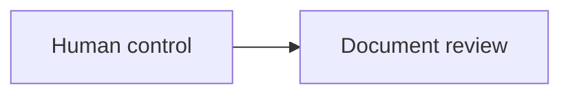

# Formats And Diagrams

## One truth, several views

Use this grammar:

```text
Markdown or machine schema -> exact truth
Diagram                   -> selected relationships
HTML .view.html           -> guided exploration
```

A diagram answers one explicit question. A map is intentionally selective; a
focused model may own one exact flow, state set, sequence, or boundary. Never
copy a canonical explanation into a map and an HTML view.

## Stable links

Use `cr://document.id` or `cr://document.id#anchor` when the target must survive a file move. Relative Markdown or HTML links remain appropriate for portable nearby references.

## Mermaid

Mermaid is appropriate when relationships, branching, state, or sequence are materially clearer spatially.



Context Room renders an inert diagram and reconnects only recognized `cr://` links. Do not use callbacks, external URLs, HTML labels, security directives, or executable content.

Keep a local diagram embedded. Use `.diagram.md` when it is reusable,
independently reviewed, central to navigation, or needs its own maintenance
dependencies. Prefer 5 to 15 meaningful nodes; split dense views into a small
parent map and focused children. Give complex diagrams a textual description of
their essential nodes and relations.

## HTML

Place the same YAML contract in a comment immediately after the doctype:

```html
<!doctype html>
<!--
context_room:
  id: product.system-map
  depends_on:
    - product.architecture
-->
```

Use semantic HTML. Scripts, handlers, forms, callbacks, and external resources are removed from preview. A safe relative `href` may accompany `data-cr-document="product.architecture"` as a portable fallback.

Use HTML only for coordinated views, progressive exploration, filtering,
comparison, walkthroughs, traces, or other interactions that remove real
cognitive work. Prefer a descriptive `.view.html` suffix. Compose canonical
owners through supported projections or explicit links; do not paste their full
truth into the view. Keep essential meaning in the semantic DOM and expose a
clear path to every source owner.

## Images and machine schemas

Link images and schema files from the document that explains them. When a visual is a first-class document, provide a textual Markdown or HTML wrapper that owns its meaning and relationships.
