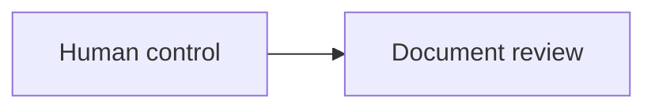

# Formats And Diagrams

## Stable links

Use `cr://document.id` or `cr://document.id#anchor` when the target must survive a file move. Relative Markdown or HTML links remain appropriate for portable nearby references.

## Mermaid

Mermaid is appropriate when relationships, branching, state, or sequence are materially clearer spatially.



Context Room renders an inert diagram and reconnects only recognized `cr://` links. Do not use callbacks, external URLs, HTML labels, security directives, or executable content.

## HTML

Place the same YAML contract in a comment immediately after the doctype:

```html
<!doctype html>
<!--
context_room:
  id: product.system-map
  depends_on:
    - product.architecture
-->
```

Use semantic HTML. Scripts, handlers, forms, callbacks, and external resources are removed from preview. A safe relative `href` may accompany `data-cr-document="product.architecture"` as a portable fallback.

## Images and machine schemas

Link images and schema files from the document that explains them. When a visual is a first-class document, provide a textual Markdown or HTML wrapper that owns its meaning and relationships.
