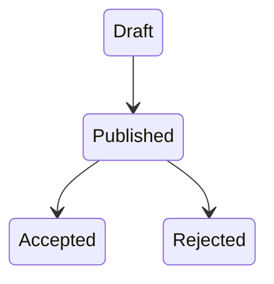
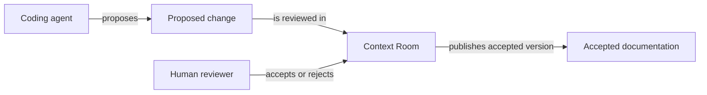

# Documentation Formats And Visual Diagrams

## Choose the simplest adequate format

Use this decision order:

```text
Clear in prose or a small table?
  → Markdown

Primarily relationships, order, states, boundaries, or handoffs?
  → Mermaid in Markdown

Needs precise spatial composition, multiple coordinated views,
rich comparison, or native interaction?
  → HTML

Static screenshot, external visual, or visual evidence?
  → PNG or SVG attached to a text document
```

A visual diagram is a real document that helps a reader understand the project. It is different from the automatically derived dependency and backlink data Context Room uses for maintenance.

## Markdown

Markdown is the default for durable truth, rules, explanations, decisions, changes, procedures, and references.

Place Context Room YAML frontmatter at the beginning:

```markdown
---
context_room:
  id: product.billing.invoice-export
  depends_on:
    - strategy.offer.billing
  artifacts:
    code:
      - src/billing/export/**
---

# Invoice export

> **Summary:** ...
>
> **Defines:** ...
>
> **Does not define:** ...
```

Use tables for aligned comparison. Use lists for genuinely discrete items. Prefer prose when the relationship between ideas matters.

## Mermaid diagram documents

Mermaid is the default diagram format because it remains text, diffable, searchable, and easy for humans and agents to edit.

### When the diagram stays inside another document

Embed Mermaid in a normal Markdown file when it explains only one local section.

```markdown
## Proposal lifecycle


```

The containing document owns the diagram's metadata and meaning.

### When the diagram becomes its own document

Create a separate diagram document when it is:

- a reusable map;
- a cross-document explanation;
- a navigation point;
- independently reviewed;
- referenced from several documents; or
- too large for a local section.

Use these file conventions:

```text
PROJECT-MAP.diagram.md
review-map.diagram.md
review-flow.diagram.md
proposal-states.diagram.md
```

A standalone diagram uses the same YAML and visible document contract as Markdown:

````markdown
---
context_room:
  id: system.review.review-flow
  depends_on:
    - product.review.human-approval
    - system.review.review-engine
---

# Review flow

> **Summary:** This diagram shows how an agent proposal becomes accepted documentation through a human decision.
>
> **Defines:** The actors, handoffs, and outcomes in the document review flow.
>
> **Does not define:** Git transport details or the internal review-state schema.


````

### Three diagram families

Use three broad families instead of a large taxonomy:

- **Map** — parts, actors, ownership, boundaries, and main connections;
- **Flow** — order, actions, handoffs, branches, errors, and sequences; and
- **State** — lifecycle states and the events that cause transitions.

A sequence diagram is a focused form of flow. A decision tree is also a flow.

### Visual hierarchy for large projects

Scale understanding through levels:

1. `docs/PROJECT-MAP.diagram.md` — the six zones and major domains;
2. domain maps — the main actors, parts, boundaries, and entry points; and
3. focused flows or state diagrams — one behavior or lifecycle.

The project map links to domain maps. Domain maps link to focused diagrams and detailed documents. Never create one diagram containing the entire project.

### Diagram design rules

- Answer one explicit question.
- Prefer 5 to 15 meaningful nodes in one view.
- Keep one main reading direction.
- Label non-obvious arrows with natural language.
- Keep node labels short; put detail in surrounding text.
- Split the subject when crossings or scale make it harder to read.
- Use color only as a secondary signal.
- Keep essential meaning available in text and labels.
- Do not diagram an idea that is clearer in a few sentences.

Arrow labels are explanatory and free-form. They are not YAML dependency types.

### Context Room document links in Mermaid

Use stable Context Room IDs for nodes that represent first-class documents:

```mermaid
click review "cr://product.review.human-approval"
click states "cr://system.review.proposal-states#rejected"
```

Context Room resolves the ID to the document's current path and optional section. Do not use JavaScript callbacks. Nodes that are merely concepts do not need links.

A visual arrow does not create `depends_on`. Declare a YAML dependency only when the diagram itself may become stale after the target document changes.

Context Room should derive an `appears in diagram` backlink for linked document nodes.

## Visual HTML documents

Use HTML when Markdown or Mermaid cannot express the subject clearly enough, for example:

- several coordinated views on one page;
- a rich architecture or market map;
- a positioning matrix;
- a dashboard or scorecard;
- a complex comparison;
- expandable secondary detail;
- a reasoning map; or
- a layout where spatial grouping is essential.

Do not use HTML merely to make simple prose look more decorative.

### HTML metadata

Keep the file valid HTML and place the same YAML contract in a comment immediately after the doctype:

```html
<!doctype html>

<!--
context_room:
  id: strategy.positioning.market-map
  depends_on:
    - strategy.positioning
  artifacts:
    assets:
      - market-research.csv
-->

<html lang="en">
```

### Visible HTML document contract

The rendered page must visibly contain:

- a literal title;
- summary;
- what it defines;
- what it does not define; and
- the useful visual content.

Use semantic HTML, native controls, accessible source order, keyboard-visible focus, and Context Room theme classes or variables. Do not embed scripts, external runtime dependencies, a separate theme system, or interaction required to reveal the primary conclusion.

### Context Room links in HTML

Use a real anchor for portable browser behavior and a stable document ID for Context Room resolution:

```html
<a
  class="cr-diagram-node"
  href="../../product/review/human-approval.md"
  data-cr-document="product.review.human-approval">
  <strong>Human approval</strong>
  <span>Only a human can accept the exact document version.</span>
</a>
```

`href` is the portable fallback. `data-cr-document` is the stable identity. Context Room may resolve a moved document and warn when the fallback path is stale.

### When HTML replaces Mermaid

Prefer HTML rather than forcing Mermaid when the visual needs:

- several simultaneous layers;
- a stable custom layout;
- rich cards or comparison panels;
- accessible expandable details;
- multiple selectable views; or
- a mix of diagrams, metrics, and explanation.

Keep HTML source readable. The visual is still documentation, not an application embedded inside documentation.

## PNG, SVG, and other images

Do not embed Context Room YAML in binary PNG metadata, EXIF, or another image-only side channel.

Images are normally artifacts attached to a Markdown or HTML owner. Use them for:

- screenshots;
- evidence of an external state;
- externally supplied visuals;
- photographs;
- design mockups; or
- static renders whose editable source is also preserved.

Reference the file from the owning document:

```yaml
context_room:
  id: evolution.record.incident-42
  artifacts:
    assets:
      - error-screen.png
      - incident-timeline.svg
```

### Standalone image wrapper

When an image must be discoverable as a first-class visual document, create a text wrapper:

```text
error-screen.png
error-screen.image.md
```

The wrapper uses normal Markdown YAML and owns:

- stable ID and dependencies;
- title, summary, `Defines`, and `Does not define`;
- accessible alt text and caption;
- provenance, source, and capture date when relevant; and
- the image path under `artifacts.assets`.

Example:

```markdown
---
context_room:
  id: evolution.record.incident-42.error-screen
  depends_on:
    - evolution.record.incident-42
  artifacts:
    assets:
      - error-screen.png
---

# Authentication error shown during incident 42

> **Summary:** The production client displayed a generic authentication failure while refresh requests were timing out.
>
> **Defines:** The provenance and interpretation of this incident screenshot.
>
> **Does not define:** The incident root cause or remediation.


Captured from production on 2026-07-29 at 14:12 UTC.
```

Do not make an image the only place where an essential rule or explanation exists. A PNG cannot provide navigable Context Room nodes; use Mermaid or HTML when redirection is part of the purpose.

## Raw Mermaid and machine schemas

A raw `.mmd` file is normally an asset of a Markdown or HTML owner. Prefer `.diagram.md` when the diagram is itself a first-class document.

OpenAPI, JSON Schema, Protobuf, SQL definitions, and similar machine contracts normally remain artifacts. Do not inject Context Room metadata into their native top-level structure. Pair them with a Markdown document that explains their purpose and semantics and references them under `artifacts.schemas`.

## Four connection types

Keep these concepts separate:

| Connection | Source | Meaning |
| --- | --- | --- |
| Maintenance dependency | YAML `depends_on` | The current document may need review when the target changes. |
| Reference | Markdown link or HTML `href` | The target helps the reader understand or navigate. |
| Visual connection | Mermaid arrow or HTML diagram edge | Explains how concepts, actors, states, or parts relate in this visual. |
| Artifact connection | YAML `artifacts` | Connects the document to code, tests, machine schemas, config, telemetry, examples, or assets. |

Context Room should derive:

```text
depends on / depended on by
references / referenced by
appears in diagram
artifacts
```

Never maintain the inverse lists manually.
