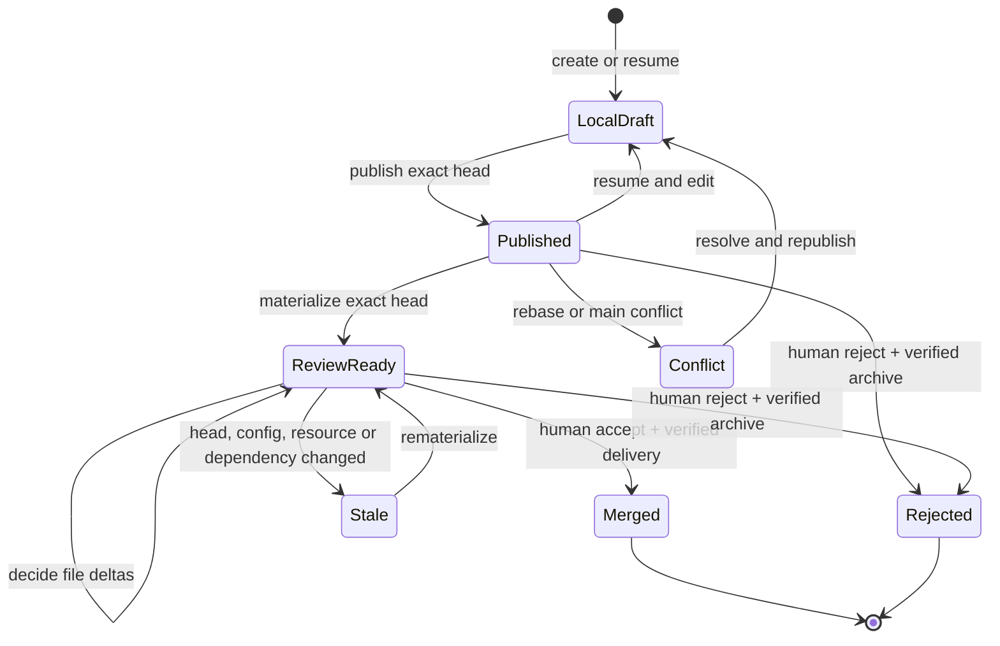

---
context_room:
  id: domains.shared.proposal-lifecycle
  depends_on:
    - domains.truth.layers
    - assurance.review.human-authority
---

# Shared Proposal Lifecycle

## Summary

A Shared proposal is an isolated exact-revision change that becomes accepted truth only after complete human file review, an explicit terminal decision, atomic remote delivery, and verification that accepted main contains the exact reviewed result.

## Defines

This document defines proposal identity, states, transitions, invariants, concurrency rules, and recovery outcomes independent of UI layout and implementation function names.

## Does not define

This document does not define button labels, HTTP paths, Git command syntax, repository JSON fields, or deployment.

## Identity

A proposal is identified by Shared repository, branch, scope, project ID when applicable, base accepted revision, and exact head. Review authority binds to one exact head. A changed head requires new materialization and review.

## States

## Hub projection

| Projection state | Class | Required behavior |
| --- | --- | --- |
| `ready`, `in_review`, `updated` | Active | Visible and openable. `updated` requires exact rematerialization; prior review evidence is not reused for a changed head. |
| `accepted` without accepted-main proof and other pending recovery states | Attention | A live, non-integrated proposal branch still needs delivery, conflict, rejection, or authority recovery. Visible and non-openable as an active review. |
| `merged`, `rejected`, `acceptance_recovery_required`, `external_merge_recovery_required`, `terminal_conflict_recovery_required`, or `accepted` with accepted-main proof | Terminal or integrated | Absent from the active proposal list. Exact accepted-main, terminal-state, archive, and decision evidence remain available for exact action revalidation. |
| `externally_deleted` | No active proposal | Absent from the active proposal list because no proposal branch exists. Missing terminal evidence belongs to diagnostics, not the review queue. |

Only a live proposal branch whose exact changes are not already integrated into accepted main can appear in the active proposal list. A direct link to a terminal, integrated, or missing proposal still fails closed with its exact state; hiding it from the queue does not authorize another review or terminal action.

## Create and resume

Creation starts from current accepted main and creates an isolated worktree and unique branch. A session may resume only its own non-terminal proposal when repository, scope, session identity, and exact remote state match. Several proposals can coexist.

## Edit

Agent editing is restricted to the proposal worktree and authorized scope. Project proposals cannot change global or unrelated paths. Skill and instruction proposals can change only their accepted collections and manifests.

A new project proposal may append exactly one source-less catalog entry and one initial Markdown document. The bundle is terminally atomic.

## Publish

Publishing verifies expected remote head and terminal state, rejects reused terminal branches, validates scope and file safety, commits exact local changes, rebases onto current accepted main when required, marks semantic re-review after rebase, and atomically updates branch plus active-state ref with leases.

A stale head, unsupported atomic push, conflict, scope violation, timeout, or unverifiable result fails without claiming success.

## Review materialization

Materialization binds repository, branch, exact head, reviewed base, changed files, safe modes, resource versions, and direct dependency versions. Each human file decision records exact current evidence. Changed content, mode, resource, dependency, or head invalidates stale evidence.

An existing materialization may be reused only when repository, branch, exact head, and accepted-main revision all match the requested snapshot. A missing, stale, or mismatched field blocks reuse and requires current exact materialization. Cache reuse never converts an attention or terminal projection back into an active review.

## Terminal revalidation

Cached listing or materialization state never authorizes a terminal action. Every accept or reject attempt revalidates current repository state, branch, exact head, accepted-main revision, terminal configuration, and human authority before mutation.

## Accept

Acceptance requires complete current trusted review, unchanged terminal configuration and head, compatible accepted-main ancestry, no protected-path conflict, and an exact reviewed patch.

Delivery atomically updates accepted main, records terminal state, and deletes the exact proposal branch under a remote lease. Context Room fetches the default branch, proves the accepted commit is reachable and bound to the exact proposal head, and proves the proposal branch is absent before reporting success and recording the owner decision. The acceptance commit and protected terminal-state ref preserve exact evidence without keeping a live proposal branch.

## Reject

Rejection archives the exact head, atomically records terminal state, verifies both remote facts, and records the owner decision. It never changes accepted main. Unpublished local work is preserved when safe cleanup cannot be proved.

## Concurrency

- Exact repository/proposal/head locks serialize terminal work.
- Distributed homes compete through atomic remote refs and leases.
- Accept and reject cannot both succeed for one head.
- Publishing a new head cannot race through terminal action for the old head.
- Concurrent main changes to protected reviewed paths require rematerialization.
- Timeouts never imply success; retries re-read remote evidence.

## Human authority

The decision is human-owned. Agent assistance requires two separate explicit confirmations for the same action and scope. Technical challenges bind the final request but do not prove physical human presence against same-user automation.
