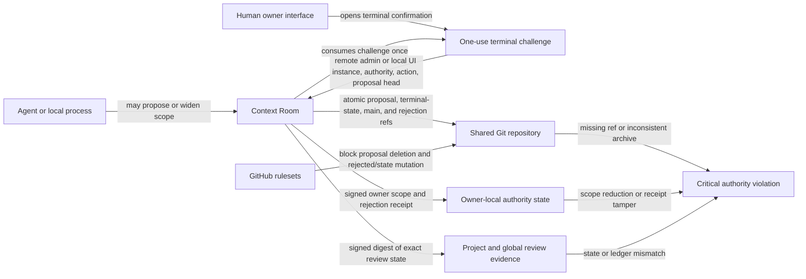

---
context_room:
  id: assurance.review-authority
  kind: canonical
  scope: context-room
  status: current
  canonical_for: human review authority and its security boundary
  last_verified: 2026-08-09
  sources: [src/review_authority.mjs, src/context_room.mjs, src/context_settings.mjs, src/shared_context.mjs, src/github_app_token.mjs, src/event_journal.mjs, src/cli_registry.mjs, bin/context-room.mjs, bin/context-room-remote.mjs, test/review_authority.test.mjs, test/context_settings.test.mjs, test/context_room.test.mjs, test/shared_context.test.mjs, test/shared_terminal_cas.test.mjs, test/remote_accept_challenge.test.mjs, test/hosted_scope_boundary.test.mjs, test/acceptance_timeout.test.mjs, test/event_journal_context_engine.test.mjs]
---

# Review Authority

## Summary

Accepting, rejecting, verifying, or confirming removal of documentation is a human-owned action. Context Room blocks agent-facing decision commands, refuses agent-driven reductions of the review scope, fails closed when project configuration narrows the last owner-authorized scope, and preserves evidence when a shared proposal ref disappears unexpectedly. Individual file decisions are direct actions in the human UI. Multi-file batches and terminal proposal decisions require the agent operating that surface to ask once, then after the first yes restate the exact action, project, proposal or file scope, and effects, ask again, and make no mutation without a second separate, unambiguous yes.

These controls are defense in depth. A process with unrestricted access to the same operating-system account can read local files, drive the browser, or invoke Git directly. Local nonces, one-use terminal challenges, and signed receipts detect or block ordinary bypasses; they do not prove physical human presence. Strong enforcement against that process requires an external trust anchor such as provider-side rules with a separate reviewer identity, a passkey or hardware-backed user-presence check, or a separately sandboxed account.

## Defines

The authority invariants, implemented controls, failure behavior, recovery path, and remaining same-user limitation for local reviews and Shared Context proposals.

## Does not define

The content-level review workflow, GitHub account administration, or a hardware-backed reviewer identity. Those are owned respectively by [Review queue](review-queue.md), [Shared Context](shared-context.md), and a future authenticated human-presence capability.

## Invariants

1. No agent-facing CLI command may accept, reject, verify, or merge documentation for the owner.
2. A single-file decision is available only through the direct human UI and does not require the agent-confirmation modal. Before an agent attempts a multi-file batch or terminal proposal decision through a human surface, it must obtain two separate explicit user confirmations. The second request follows a restatement of the exact action, scope, and effects; without a second unambiguous yes, nothing changes.
3. An agent may add or widen review coverage, but only the owner interface may narrow or remove it.
4. Editing `.context-room/config.json` cannot silently reduce effective review coverage below the last owner-authorized scope.
5. A terminal shared-proposal decision is bound to the exact proposal branch and commit hash.
6. Shared acceptance additionally requires one fresh, one-use server challenge bound to the signed administrator identity on remote QM, or to the current owner-interface nonce instance in local mode, plus the review authority, `accept` action, and exact proposal head. The local binding proves continuity with that interface instance, not a person's physical identity.
7. Rejecting a shared proposal archives its exact commit without deleting the protected `proposal/*` ref.
8. Disappearance of a previously observed proposal without exact accepted or rejected evidence remains visible as a critical authority violation.
9. Shared acceptance requires current signed review evidence for every proposal-changed path. That evidence binds the present or absent state, exact content, and safe Git resource mode; a rejected file additionally requires a human-confirmed absent version.
10. In hosted whole-file review, the client supplies only the exact proposal head, a decision, and canonical manifest paths. The server derives the expected states, contents, hashes, safe modes, rename semantics, dependency versions, and signed receipt from the exact review. Client-supplied evidence is never authority.
11. Hosted review authority is valid only when its complete path list and derived manifest remain inside the proposal's path policy and either a configured project ID or a special scope explicitly assigned to that repository. Project IDs never imply the separate `global`, `skills`, or `instructions` authority. One out-of-scope path rejects the whole room before review-state or resource-content disclosure; a response serializer can remove data but never widen authority.
12. Recovery after an uncertain delivery requires both the exact proposal trailers and a commit tree that equals the reviewed result applied to that commit's single parent. Symlinks, gitlinks, special entries, an unexpected executable-bit change, or any other tree mismatch fail closed.
13. Missing, altered, recovered, or inconsistent evidence never means reviewed.
14. An exact distributed accepted state prevents reopening or republishing the proposal on every installation. An exact distributed rejected state without this installation's signed owner receipt remains visible as `unverified_rejection` until an explicit human recovery records that receipt. Matching Git trailers alone never confer acceptance-recovery authority.
15. Publication, acceptance, and rejection of one exact repository, proposal branch, and proposal head share one terminal-decision lock inside a Shared Home and one distributed `context-room-state/<sha256(proposal-branch)>` Git compare-and-set across installations. Publication moves the proposal and active state together; acceptance moves accepted `main` and terminal state together; rejection moves the exact archive and terminal state together. A stale publisher or losing terminal decision receives a conflict without a partial remote transition or receipt mutation.
16. A signed terminal receipt is append-only for its exact proposal revision. Repeating the same decision with the same archive or accepted commit is a no-op that preserves the first actor and time; an opposite outcome or different durable pointer fails closed.
17. A local terminal lease belongs to one process generation, not to a PID alone. A live matching generation remains protected after nominal expiry; an expired legacy owner or reused PID whose generation no longer matches is reclaimable without removing a fresh successor lock.

## Control Layers



The diagram shows the intended chain, not a claim that local state authenticates a physical person. The owner UI, local authority state, and ordinary agent processes still share one OS account in the default local deployment.

## Implemented Controls

| Bypass | Current behavior | Remaining limit |
| --- | --- | --- |
| Agent CLI calls `accept`, `reject`, or `verify` | No such decision command is exposed. | A same-user process can still target lower-level local resources unless the other layers also hold. |
| Agent receives one conversational approval, then tries a batch or terminal proposal decision in the owner UI | Agent instructions, machine capabilities, generated handoffs, and those higher-impact decision surfaces require a second separate approval after the exact action, scope, and effects are restated. Individual file controls remain direct human actions and are never exposed as agent commands. | This is a behavioral guard and visible checkpoint, not proof that two human utterances occurred; browser automation under the same OS account can still imitate the acknowledgement. |
| Agent removes or narrows `watchAllow`, `watchRules`, `allowedPaths`, Startup context, or Startup skills through typed settings | The plan is rejected with `human-authority-required`. | The owner may intentionally save a narrower scope in Settings. |
| Agent runs `watch set --mode off`, `agent unwatch`, replaces a live rule with a narrower mode, or inserts a narrower child rule beneath a recursive parent | The command is rejected with `human-authority-required`. Direct config and typed-settings evaluation also widen an overriding child back to the protected semantics. Adding a new rule or widening an existing rule remains allowed. | Direct filesystem access is handled by the next layer, not by the CLI alone. |
| Process edits `.context-room/config.json` directly | Context Room keeps the last owner-authorized scope effective and reports `review_authority_tamper` as critical. | The HMAC key is local to the same OS account; this detects tampering but is not a hostile same-user boundary. |
| Process sends a raw review or owner-settings HTTP request | Protected local mutations require the per-server owner nonce injected into the current UI. Headerless requests fail with `review_authority_nonce_required`. Terminal acceptance also requires its separate one-use challenge. | Browser automation or a process that can read the page can obtain the nonce. It is request provenance, not user-presence proof. |
| Process edits the project review-state JSON or the global review ledger | Context Room compares the normalized state with its mirrored signed digest. Altered claims are ignored and `review_evidence_tamper` is reported as critical. | A same-user process that can erase both authority mirrors and the key is outside the local trust boundary. |
| Process calls shared acceptance directly | Acceptance reloads trusted review evidence and requires both a current exact `verified` decision for every proposal-changed path and unchanged direct dependency selected for review, and a fresh matching terminal challenge. Missing, stale, altered, recovered, absent-without-version, expired, reused, or mismatched evidence fails closed. In remote QM mode, both challenge creation and direct acceptance return `503 shared_context_remote_acceptance_unavailable` when the repository-scoped GitHub App is not configured. | A same-user process can drive the owner UI and obtain a challenge; external human-presence proof is stronger. |
| Process deletes a remote `proposal/*` ref | A Context Room-published or previously observed proposal remains in the queue as `externally_deleted`; review actions are disabled and recovery is required. | A never-observed branch cannot be reconstructed from local evidence. Provider-side deletion protection closes this gap. |
| Process creates the exact `rejected/*` archive and a structurally valid rejected state marker | Context Room does not record or hide it as a human rejection without a signed owner receipt. It remains visible as `unverified_rejection`, and mutation fails closed until the owner explicitly confirms recovery. | GitHub rulesets protect deletion and later non-fast-forward mutation, but cannot distinguish the initial creation by a repository writer. A write-capable deploy key can therefore cause a visible availability block; preventing that requires provider-side creation authority held by a separate reviewer identity. |
| Rejection archive is changed or removed | The proposal stays visible as `rejection_archive_missing`; rejected refs are intended to be immutable. | Remote enforcement depends on the repository rulesets being installed and verified. |
| Two Context Room processes, including processes with separate Shared Homes, attempt an opposite terminal decision or race proposal republishing against a terminal decision | The local terminal lock serializes one Shared Home. Across installations, the exact `context-room-state/<sha256(proposal-branch)>` ref is advanced in the same atomic push as the proposal, accepted `main`, or rejection archive. The winner rechecks fetched terminal evidence; the loser receives a conflict and cannot commit a partial opposite outcome. | The remote must support atomic pushes, and repository permissions remain the boundary against an unrelated actor that can write the protected proposal, state, default-branch, or rejection refs directly. |
| A process PID is reused while an old local terminal lease remains | Context Room compares the recorded process generation as well as the host and PID. A matching live generation stays protected; an expired legacy record or mismatched generation is reclaimed under the coordination lock. | When the operating system cannot expose a current generation for an owner that recorded one, Context Room fails closed and preserves the lease. |
| Local cache or observation ledger is deleted | The accepted remote and still-present proposal refs can be fetched again. | Local-only observation history is lost; provider-side ref protection is the durable prevention layer. |
| Local Git hook is skipped or another clone is used | No local hook is treated as the final authority boundary. | Provider rules or a separate authenticated reviewer are required. |

## Owner-Local State

The last owner-authorized review scope is stored outside the project config under `~/.context-room/hub/review-authority/` by default. Context Room signs the normalized protected scope with a private local HMAC key and applies it monotonically over project settings. A human Settings save replaces that protected scope intentionally. Critical authority records use a primary file plus a signed backup; recovery keeps the scope protected and raises a critical integrity warning. If neither mirror verifies, Context Room refuses to calculate an effective review scope instead of falling back to the project configuration.

The exact normalized project review state and global review ledger are also bound to owner-local signed digests. Directly editing either JSON file does not create trusted review evidence. Shared acceptance rejects authority recovered from a damaged primary record until the decisions are re-established through the owner flow.

Shared proposal rejection receipts use the corresponding private authority directory under `~/.context-room/shared/`. They record the repository, proposal branch, exact head, terminal decision, archive ref, actor label, and time. A proposal leaves the active queue as human-rejected only when that signed receipt and the exact remote archive agree. Invalid JSON, missing signatures, signature mismatch, or repository mismatch cannot be replaced by a remote archive or state marker; those remote objects remain visible as unverified authority until explicit human recovery.

Successful acceptance records its exact proposal, proposal head, accepted commit, verified remote head, default branch, and reviewer metadata in the same private authority area. The receipt is written to a private temporary file and atomically renamed only after remote delivery is proved. A missing or corrupt receipt can therefore be rebuilt only from stronger Git evidence: the exact proposal trailers, a single-parent commit whose complete tree equals the reviewed result applied to that parent, safe blob modes and entry types, and renewed proof that the remote default branch contains that commit. Matching trailers alone never authorize recovery.

Project configuration remains portable intent. Owner-local authority state is the anti-silent-narrowing control for this device; it is intentionally not committed to the project.

Moving a hosted technical project from the legacy flat projects directory into
its opaque repository namespace is storage migration, not a review decision. It
must preserve the complete project tree and its exact state; it cannot merge
partial trees, manufacture review evidence, or turn missing evidence into a
current decision. The separate hosted review-authority and Shared authority
homes remain under the same backed-up data root. If the project-to-repository
mapping, binding, copied state, or validation evidence is ambiguous after a
migration attempt, Context Room remains stopped and the operator restores the
complete verified volume backup. See the fail-closed procedure in
[Remote QM](../remote-qm.md).

## Terminal Acceptance Challenges

Opening **Put on main** records `proposal.acceptance.confirmation_opened` and issues a short-lived challenge for the signed QM administrator identity, or the current owner-interface nonce instance in local mode, together with the review authority, `accept` action, and proposal head. Confirming the dialog records `proposal.acceptance.confirmed` and consumes that challenge before any Git acceptance work begins. A challenge cannot authorize another proposal, revision, action, remote administrator, local interface instance, or recovered authority state, and a consumed or expired challenge cannot be replayed. These audit entries contain decision metadata, not document content, and never replace the signed per-file review evidence.

Hosted whole-file batching changes only how paths and file evidence cross the
server boundary. It does not replace the two explicit confirmations required
when an agent operates a multi-file or terminal surface, and it does not replace
the terminal acceptance challenge.

The GitHub App installation-token request has a 15-second budget. Clone, initial fetch, push, and delivery-verification fetch each use a non-zero 120-second Git delivery budget in both remote and local acceptance. A timeout returns HTTP `504` with `retryable: true` and either `github-app-token-timeout` or `shared-delivery-timeout`; the consumed challenge is not replayed, so **Retry** opens a fresh terminal confirmation.

## Shared Proposal Evidence

Context Room records a proposal observation when it publishes the proposal and refreshes that observation when the remote queue is listed. Human rejection:

1. verifies that the displayed head is still current;
2. refuses to discard unpublished worktree changes;
3. atomically creates `rejected/<proposal-suffix>-<short-hash>` and advances the exact distributed terminal-state ref;
4. records the signed exact owner decision receipt;
5. leaves `proposal/<scope>/<name>` intact; and
6. removes the item from the active queue only while the receipt, archive, and terminal state agree on the exact proposal head.

If the atomic archive and terminal-state push reached the remote but the
response or local receipt was lost, an explicit human retry fetches and verifies
both refs, repairs the missing signed receipt, and returns the same rejection
without moving `proposal/*`, `rejected/*`, or the default branch. A legacy exact
archive without terminal state also requires that explicit human recovery; the
retry creates the missing state ref before recording the receipt. A previously
signed opposite decision, an acceptance candidate on the default branch, or a
mismatched archive returns a conflict without mutation.

If a proposal ref disappears without an exact accepted-main commit, a compatible delivery path's exact accepted ref, or matching signed rejection evidence, the last known proposal metadata remains visible. The current direct in-app fast-forward flow proves acceptance through the default-branch commit, distributed terminal state, and signed receipt; it does not create an `accepted/*` ref. The owner must restore the proposal ref before review continues when none of those exact terminal proofs exists.

## GitHub Repository Protection

`context-room shared secure-github --root .` installs or updates four no-bypass branch rulesets:

- default-branch pull-request protection with one approving review, stale approvals dismissed after a push, last-push approval, resolved review threads, deletion protection, and force-push protection;
- deletion protection for `refs/heads/<proposal-prefix>/**/*`; and
- deletion, force-push, and update protection for `refs/heads/<rejection-prefix>/**/*`; and
- deletion and non-fast-forward protection for `refs/heads/context-room-state/*`.

`context-room shared security-check --root .` verifies all four rulesets plus the configured agent deploy key. This command changes or inspects the live GitHub repository and therefore remains a protected owner operation. The default-branch rule deliberately requires a distinct approving review and can block direct in-app finalization; repository owners must choose a delivery model whose reviewer identity and branch rules agree.

Do not treat local hooks or filesystem permissions within one user account as equivalent to these provider-side controls. The rejection and state rules make existing evidence immutable but do not authenticate initial ref creation. Context Room therefore requires the signed owner receipt before treating a rejection as human-owned; a forged exact remote pair remains a visible fail-closed availability incident.

## Recovery

For `externally_deleted`:

1. stop review and do not create a replacement proposal with the same name;
2. inspect the displayed last-known branch and exact head;
3. restore that exact commit to the original `proposal/*` ref from a known clone, object database, or backup;
4. run `context-room shared security-check --root .`;
5. install or repair the proposal, rejection, and terminal-state rulesets if the repository owner approves;
6. refresh Context Room and confirm that the proposal returns at the same head; and
7. continue review only after the authority warning clears.

For `rejection_archive_missing`, preserve the proposal, archive, and terminal-state refs and compare their exact hashes. A mismatched or missing archive still fails closed even when a local receipt says rejected. Never delete evidence to clear the warning. When an exact archive or rejected state exists without a valid local receipt, the proposal remains visible as `unverified_rejection`; the owner must inspect it and explicitly confirm recovery before Context Room records the receipt and removes it from the active queue.

## Verification

The security regression suite covers:

- agent settings and watch commands refusing scope reduction;
- direct config narrowing retaining the effective owner scope and producing a critical diagnostic;
- direct review-state and global-ledger forgery being ignored and reported as critical;
- protected local HTTP mutations requiring the current UI nonce;
- exact-revision decision receipts detecting tampering;
- cross-process terminal decisions sharing one exact generation-aware local lock, cross-Shared-Home opposite outcomes and stale republishing losing the distributed terminal compare-and-set without partial remote mutation, terminal state remaining authoritative after a proposal ref disappears, concurrent receipt writes retaining every proposal decision, and concurrent first writes publishing one complete HMAC key;
- exact acceptance and rejection retries preserving the first signed actor and time, including reconstruction after a rejection archive reached the remote before its local receipt;
- terminal acceptance endpoints recording `proposal.acceptance.confirmation_opened` then `proposal.acceptance.confirmed`, with the signed remote administrator or local owner-interface principal and no challenge identifier;
- remote challenge and acceptance endpoints returning `503` before authority or Git mutation when no GitHub App is configured;
- 15-second GitHub App token and 120-second Git delivery budgets surfacing retryable timeouts without reporting or recording success;
- uncertain-delivery recovery requiring exact proposal trailers, the exact reviewed single-parent tree, and safe resource modes and entry types before an atomic acceptance receipt is reconciled;
- direct shared acceptance refusing incomplete exact human file decisions;
- human rejection preserving the proposal ref;
- external proposal deletion remaining visible; and
- GitHub payloads protecting default, proposal, rejection, and distributed terminal-state refs without bypass actors.

Run the focused checks with:

```bash
node --test test/review_authority.test.mjs test/context_settings.test.mjs
node --test --test-name-pattern='review authority|externally deleted proposal|rejecting a proposal|GitHub security setup' test/context_room.test.mjs test/shared_context.test.mjs
node --test --test-name-pattern='terminal acceptance endpoints journal' test/shared_context.test.mjs
node --test test/shared_terminal_cas.test.mjs
node --test test/remote_accept_challenge.test.mjs test/acceptance_timeout.test.mjs
```
