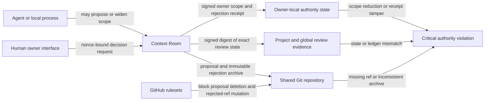

---
context_room:
  id: assurance.review-authority
  kind: canonical
  scope: context-room
  status: current
  canonical_for: human review authority and its security boundary
  last_verified: 2026-08-04
  sources: [src/review_authority.mjs, src/context_room.mjs, src/context_settings.mjs, src/shared_context.mjs, src/cli_registry.mjs, bin/context-room.mjs, test/review_authority.test.mjs, test/context_settings.test.mjs, test/context_room.test.mjs, test/shared_context.test.mjs]
---

# Review Authority

## Summary

Accepting, rejecting, verifying, or confirming removal of documentation is a human-owned action. Context Room blocks agent-facing decision commands, refuses agent-driven reductions of the review scope, fails closed when project configuration narrows the last owner-authorized scope, and preserves evidence when a shared proposal ref disappears unexpectedly. Individual file decisions are direct actions in the human UI. Multi-file batches and terminal proposal decisions require the agent operating that surface to ask once, then after the first yes restate the exact action, project, proposal or file scope, and effects, ask again, and make no mutation without a second separate, unambiguous yes.

These controls are defense in depth. A process with unrestricted access to the same operating-system account can read local files, drive the browser, or invoke Git directly. Local nonces and signed receipts detect or block ordinary bypasses; they do not prove physical human presence. Strong enforcement against that process requires an external trust anchor such as provider-side rules with a separate reviewer identity, a passkey or hardware-backed user-presence check, or a separately sandboxed account.

## Defines

The authority invariants, implemented controls, failure behavior, recovery path, and remaining same-user limitation for local reviews and Shared Context proposals.

## Does not define

The content-level review workflow, GitHub account administration, or a hardware-backed reviewer identity. Those are owned respectively by [Review queue](review-queue.md), [Shared Context](shared-context.md), and a future authenticated human-presence capability.

## Invariants

1. No agent-facing CLI command may accept, reject, verify, or merge documentation for the owner.
2. A single-file decision is available only through the direct human UI and does not require the agent-confirmation modal. Before an agent attempts a multi-file batch or terminal proposal decision through a human surface, it must obtain two separate explicit user confirmations. The second request follows a restatement of the exact action, scope, and effects; without a second unambiguous yes, nothing changes.
3. An agent may add or widen review coverage, but only the owner interface may narrow or remove it.
4. Editing `.context-room/config.json` cannot silently reduce effective review coverage below the last owner-authorized scope.
5. A terminal shared-proposal decision is bound to the exact proposal branch and commit hash.
6. Rejecting a shared proposal archives its exact commit without deleting the protected `proposal/*` ref.
7. Disappearance of a previously observed proposal without exact accepted or rejected evidence remains visible as a critical authority violation.
8. Shared acceptance requires current signed review evidence for every proposal-changed path, including a human-confirmed absent state for a rejected file.
9. Missing, altered, recovered, or inconsistent evidence never means reviewed.

## Control Layers



The diagram shows the intended chain, not a claim that local state authenticates a physical person. The owner UI, local authority state, and ordinary agent processes still share one OS account in the default local deployment.

## Implemented Controls

| Bypass | Current behavior | Remaining limit |
| --- | --- | --- |
| Agent CLI calls `accept`, `reject`, or `verify` | No such decision command is exposed. | A same-user process can still target lower-level local resources unless the other layers also hold. |
| Agent receives one conversational approval, then tries a batch or terminal proposal decision in the owner UI | Agent instructions, machine capabilities, generated handoffs, and those higher-impact decision surfaces require a second separate approval after the exact action, scope, and effects are restated. Individual file controls remain direct human actions and are never exposed as agent commands. | This is a behavioral guard and visible checkpoint, not proof that two human utterances occurred; browser automation under the same OS account can still imitate the acknowledgement. |
| Agent removes or narrows `watchAllow`, `watchRules`, `allowedPaths`, Startup context, or Startup skills through typed settings | The plan is rejected with `human-authority-required`. | The owner may intentionally save a narrower scope in Settings. |
| Agent runs `watch set --mode off`, `agent unwatch`, replaces a live rule with a narrower mode, or inserts a narrower child rule beneath a recursive parent | The command is rejected with `human-authority-required`. Direct config and typed-settings evaluation also widen an overriding child back to the protected semantics. Adding a new rule or widening an existing rule remains allowed. | Direct filesystem access is handled by the next layer, not by the CLI alone. |
| Process edits `.context-room/config.json` directly | Context Room keeps the last owner-authorized scope effective and reports `review_authority_tamper` as critical. | The HMAC key is local to the same OS account; this detects tampering but is not a hostile same-user boundary. |
| Process sends a raw review or owner-settings HTTP request | Protected local mutations require the per-server owner nonce injected into the current UI. Headerless requests fail with `review_authority_nonce_required`. | Browser automation or a process that can read the page can obtain the nonce. It is request provenance, not user-presence proof. |
| Process edits the project review-state JSON or the global review ledger | Context Room compares the normalized state with its mirrored signed digest. Altered claims are ignored and `review_evidence_tamper` is reported as critical. | A same-user process that can erase both authority mirrors and the key is outside the local trust boundary. |
| Process calls shared acceptance directly | Acceptance reloads trusted review evidence and requires a current exact `verified` decision for every proposal-changed path and unchanged direct dependency selected for review. Missing, stale, altered, recovered, or absent-without-version evidence fails closed. | A same-user process can invoke lower-level review writers or drive the owner UI; external human identity is stronger. |
| Process deletes a remote `proposal/*` ref | A Context Room-published or previously observed proposal remains in the queue as `externally_deleted`; review actions are disabled and recovery is required. | A never-observed branch cannot be reconstructed from local evidence. Provider-side deletion protection closes this gap. |
| Process creates a fake `rejected/*` marker | The proposal stays visible as `unverified_rejection` unless the exact archive matches an intact owner decision receipt. | A fully privileged same-user process can read the signing key; external identity remains stronger. |
| Rejection archive is changed or removed | The proposal stays visible as `rejection_archive_missing`; rejected refs are intended to be immutable. | Remote enforcement depends on the repository rulesets being installed and verified. |
| Local cache or observation ledger is deleted | The accepted remote and still-present proposal refs can be fetched again. | Local-only observation history is lost; provider-side ref protection is the durable prevention layer. |
| Local Git hook is skipped or another clone is used | No local hook is treated as the final authority boundary. | Provider rules or a separate authenticated reviewer are required. |

## Owner-Local State

The last owner-authorized review scope is stored outside the project config under `~/.context-room/hub/review-authority/` by default. Context Room signs the normalized protected scope with a private local HMAC key and applies it monotonically over project settings. A human Settings save replaces that protected scope intentionally. Critical authority records use a primary file plus a signed backup; recovery keeps the scope protected and raises a critical integrity warning. If neither mirror verifies, Context Room refuses to calculate an effective review scope instead of falling back to the project configuration.

The exact normalized project review state and global review ledger are also bound to owner-local signed digests. Directly editing either JSON file does not create trusted review evidence. Shared acceptance rejects authority recovered from a damaged primary record until the decisions are re-established through the owner flow.

Shared proposal rejection receipts use the corresponding private authority directory under `~/.context-room/shared/`. They record the repository, proposal branch, exact head, terminal decision, archive ref, actor label, and time. Invalid JSON, missing signatures, signature mismatch, or repository mismatch cannot create a trusted terminal state.

Project configuration remains portable intent. Owner-local authority state is the anti-silent-narrowing control for this device; it is intentionally not committed to the project.

## Shared Proposal Evidence

Context Room records a proposal observation when it publishes the proposal and refreshes that observation when the remote queue is listed. Human rejection:

1. verifies that the displayed head is still current;
2. refuses to discard unpublished worktree changes;
3. creates `rejected/<proposal-suffix>-<short-hash>` at the exact reviewed commit;
4. records the exact owner decision receipt;
5. leaves `proposal/<scope>/<name>` intact; and
6. removes the item from the active queue only while the receipt and archive agree.

If a proposal ref disappears without an exact accepted-main commit, accepted ref, or verified rejection receipt and archive, the last known proposal metadata remains visible. The owner must restore the ref before review continues.

## GitHub Repository Protection

`context-room shared secure-github --root .` installs or updates three no-bypass branch rulesets:

- default-branch pull-request protection with one approving review, stale approvals dismissed after a push, last-push approval, resolved review threads, deletion protection, and force-push protection;
- deletion protection for `refs/heads/<proposal-prefix>/**/*`; and
- deletion, force-push, and update protection for `refs/heads/<rejection-prefix>/**/*`.

`context-room shared security-check --root .` verifies all three rulesets plus the configured agent deploy key. This command changes or inspects the live GitHub repository and therefore remains a protected owner operation. The default-branch rule deliberately requires a distinct approving review and can block direct in-app finalization; repository owners must choose a delivery model whose reviewer identity and branch rules agree.

Do not treat local hooks, filesystem permissions within one user account, or the presence of an archive branch as equivalent to these provider-side controls.

## Recovery

For `externally_deleted`:

1. stop review and do not create a replacement proposal with the same name;
2. inspect the displayed last-known branch and exact head;
3. restore that exact commit to the original `proposal/*` ref from a known clone, object database, or backup;
4. run `context-room shared security-check --root .`;
5. install or repair the proposal and rejection rulesets if the repository owner approves;
6. refresh Context Room and confirm that the proposal returns at the same head; and
7. continue review only after the authority warning clears.

For `unverified_rejection` or `rejection_archive_missing`, preserve both refs, compare the exact hashes, and have the owner repeat or repair the decision through the current Context Room interface. Never delete evidence to clear the warning.

## Verification

The security regression suite covers:

- agent settings and watch commands refusing scope reduction;
- direct config narrowing retaining the effective owner scope and producing a critical diagnostic;
- direct review-state and global-ledger forgery being ignored and reported as critical;
- protected local HTTP mutations requiring the current UI nonce;
- exact-revision decision receipts detecting tampering;
- direct shared acceptance refusing incomplete exact human file decisions;
- human rejection preserving the proposal ref;
- external proposal deletion remaining visible; and
- GitHub payloads protecting default, proposal, and rejection refs without bypass actors.

Run the focused checks with:

```bash
node --test test/review_authority.test.mjs test/context_settings.test.mjs
node --test --test-name-pattern='review authority|externally deleted proposal|rejecting a proposal|GitHub security setup' test/context_room.test.mjs test/shared_context.test.mjs
```
