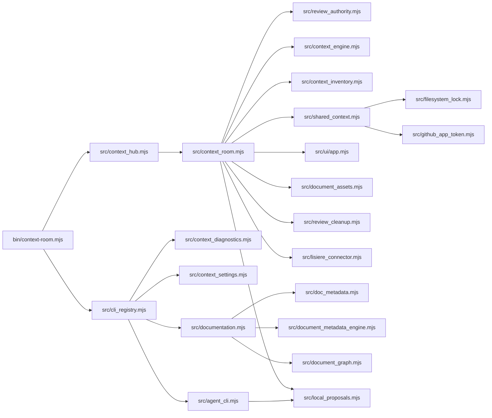

---
context_room:
  id: system.architecture
  depends_on:
    - product.model
    - system.runtime-profiles
    - domains.truth.layers
---

# System Architecture

## Summary

Context Room is a Node.js package with one declarative CLI, a global loopback Hub, project and Shared data providers, deterministic context and documentation engines, human review authority, and optional local document extensions.

## Defines

This document defines the major components, ownership boundaries, data flows, persistence classes, and the deterministic/model boundary.

## Does not define

This document does not define every HTTP route, function, schema field, UI component, deployment command, or product workflow.

## Component map

## Global Hub control plane

The private Hub registry owns registered project locations, logical-project grouping, worktree identity, display order, Shared bindings, and recovery state.

The Hub host is not an implicit project. It opens a global loopback server with no broad project allowlist and accesses a selected project only through an exact registered capability.

## Project control plane

Each initialized project keeps explicit configuration under `.context-room/`. The configuration defines authorized document paths, review coverage, startup discovery, and product organization. Owner-authorized review scope is protected by separate private authority state and cannot be narrowed merely by editing project JSON.

Background synchronization replaces configuration atomically. Read-only settings access retries a changing snapshot at most twice, rechecking the same project root and all file guards each time. Configuration writes retain exact snapshot checks and reject a concurrent replacement instead of overwriting it.

## Shared control plane

Each Shared repository has:

- canonical repository identity;
- a private clone and immutable accepted-revision cache;
- proposal and review worktrees;
- proposal, connection, resource-link, observation, and recovery registries;
- exact terminal state refs;
- owner decision evidence.

Accepted resources are read from one immutable accepted revision. Proposal and terminal mutations use bounded Git operations, private locks, leases, atomic ref updates, and post-delivery verification.

## Review control plane

Review authority is separate from mutable project configuration. It owns:

- the last owner-authorized local review scope;
- trusted exact file review state;
- the cross-room path-and-content ledger;
- exact Shared proposal review authorities;
- owner-interface nonces;
- one-use terminal challenges;
- signed owner decisions.

## Context and documentation engines

The Context Engine resolves effective, trace, and impact views from explicit resources, provider profiles, accepted Shared state, and temporal layers.

The metadata and graph components parse stable IDs, direct maintenance dependencies, references, profiles, diagrams, and truth states. Content-addressed snapshots preserve exact evidence without becoming competing owners.

## Deterministic and model boundary

The following surfaces are deterministic:

- CLI registry and envelopes;
- Context Engine;
- document inventory, metadata, graph, search, read, inspect, and validation;
- settings plans and stale checks;
- `doctor`, `guard`, and `brief`;
- review state and proposal state;
- path, schema, identity, and delivery verification.

Documentation search and reading use accepted snapshots directly. The integrated `ask` researcher and its model subprocess have been removed. Codex Prompt Center edits a compatible local runtime contract but does not call a model.

## Persistence classes

| Class | Examples | Authority |
| --- | --- | --- |
| Project configuration | `.context-room/config.json` | Project configuration constrained by owner authority |
| Private device state | Hub registry, UI preferences, local provider overrides | Local device |
| Review authority | scope, ledgers, exact decisions, challenges | Human owner |
| Accepted Shared truth | configured default branch | Human-accepted Git history |
| Proposal state | proposal branch, worktree, exact head | Pending change |
| Generated evidence | graph, coverage, snapshots, receipts | Derived, non-normative |
| Local proposal and asset state | CAS objects, workspaces, signed accepted assets, recovery journals | Prepared changes or human decision |

## Architectural constraints

- Only the loopback local runtime can start. Hosted configuration is rejected before state initialization.
- Worktrees are location variants of one logical project.
- Accepted Shared content and proposal content use different revisions and authority.
- Provider destinations are resolved through versioned profiles, not guessed by name.
- Read-only operations must not bootstrap or mutate review authority.
- Owner-only mutation routes and proposal inspection remain separate from normal accepted reads.

## Maintainability risk

In v0.6.4, `src/context_room.mjs` and `src/shared_context.mjs` concentrate many responsibilities. Documentation must follow stable product, domain, system, assurance, and operations boundaries rather than mirror these source-file boundaries.
